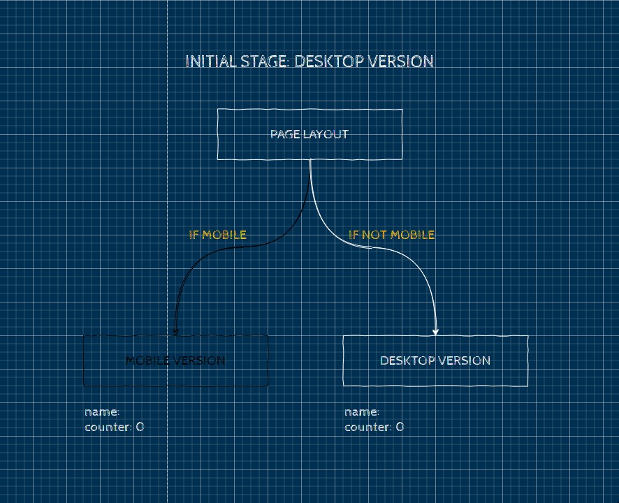
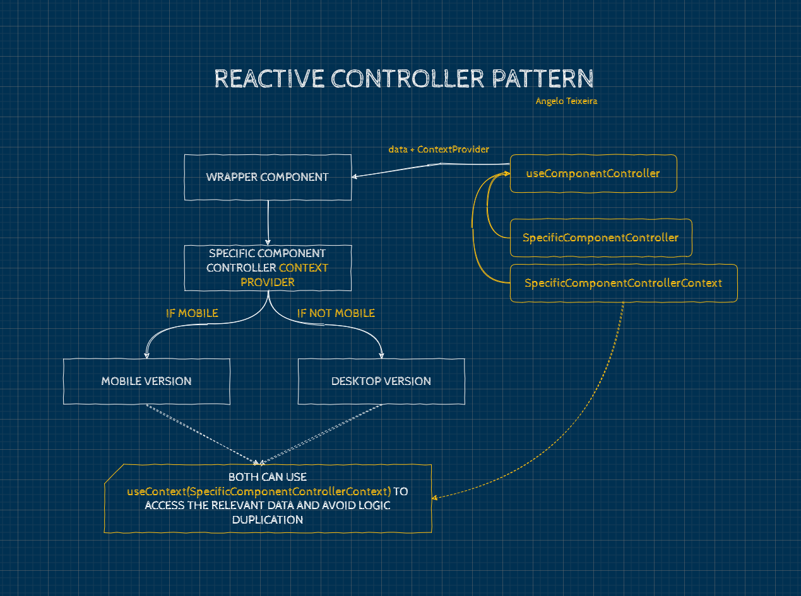

Ever had to design a web application for mobile and desktop in React? What happened once you realized that the layouts should be different enough, rendering the usual [CSS media-queries](https://developer.mozilla.org/en-US/docs/Web/CSS/Media_Queries) insufficient or too hard to work with?
<!-- end_excerpt -->
I, too, have recently found myself in a similar situation. I decided I would tackle this problem by creating two different components (and respective sub-trees) for mobile and desktop designs.

[[warning | WARNING]]
| After writing and experimenting more with this pattern, I found some issues which I describe in the next post [Reactive Controller Pattern: The chaos in returning Components from React Hooks](/blog/reactive-controller-pattern-update).
| <br><br>
| I recommend you to read it after this article to be aware of the problem and understand how to fix it!

```jsx
const DesktopVersion = () => (
    <BigComponent>
        <Button />
        <Button />
        <Button />
    </BigComponent>
);

const MobileVersion = () => (
    <SmallComponent>
        <HamburgerMenu>
            <Option />
            <Option />
            <Option />
        </HamburgerMenu>
    </SmallComponent>
);
```

Obviously, there needs to be a way to select which one to render, based on the device width (or other criteria, like meta-tags, for example). Since I was using [MaterialUI](https://material-ui.com/), I used its `useMediaQuery` hook for this purpose, but I'm certain you can find other implementations around the web as well. I wrapped it in a custom `useMobile` hook, that returns true if the width is mobile-sized, and listens for changes, updating in case it's necessary.

```jsx
const useMobile = () => 
    useMediaQuery((theme) => theme.breakpoints.only("xs"));

const MyPage = () => (
    <>
        { useMobile() ? <MobileVersion/> : <DesktopVersion/> }
        <OtherComponent1 />
        <OtherComponent2 />
    </>
);
```

This was the first step. From here, the app was not only responsive, it was *reactive*. It reacted to the device width changes and rendered the appropriate sub-tree.

## Problem: Duplicated logic

Once you have your app changing layouts correctly, you still need it to have something interesting to show in each version.

So, you start coding away your logic in each of the components, since they are different, and you might end up with something like this:

```jsx

const MobileVersion = () => {

    const [name, setName] = useState("");
    const [counter, setCounter] = useState(0);
    const [error, setError] = useState(null);

    const submitData = () => {
        validateFields({name, counter}, ValidationRules)
            .then(() => {
                fetch("URL", ....)
            })
            .catch(err => { setError(err) });
    }

    return (
        <form onSubmit={submitData}>
            <Input 
                value={name} 
                onChange={(e) => {setName(e.target.value)}}
            />
            <Input 
                type="number"
                value={counter}
                onChange={(e) => {setCounter(e.target.value)}}
            />
            {error && <ErrorMessage>{error}</ErrorMessage>
            <Button type="submit">Submit</Button>
        </form>
    )
}
```

```jsx
const DesktopVersion = () => {

    const [name, setName] = useState("");
    const [counter, setCounter] = useState(0);
    const [error, setError] = useState(null);

    const submitData = () => {
        validateFields({name, counter}, ValidationRules)
            .then(() => {
                fetch("URL", ....)
            })
            .catch(err => { setError(err) });
    }

    return (
        <form onSubmit={submitData}>
            <Input
                value={name} 
                onChange={(e) => {setName(e.target.value)}}
            />
            <FancyNumberInputComponent
                type="number"
                value={counter}
                onChange={(e) => {setCounter(e.target.value)}}
            />
            {error && <ErrorMessage>{error}</ErrorMessage>
            <Button type="submit">Submit</Button>
        </form>
    )
}
```

In this example, I tried not to complicate too much, but it's normal for the logic to be way more complex than this.

Nevertheless, I think you can already see where I'm getting at (it's in the section title anyway...): the business logic will be duplicated and as you might know, that is a bad practice since you now have to test it in two places, and if you ever need to change it, there will be two places to maintain.

> DRY: Don't Repeat Yourself

Never forget the DRY principle. We should never repeat anything if we don't have to.

The main thing we need to do to fix this problem is to move the logic one level above. It would only be in one place, and accessible by both components.

### Moving the logic above

This was what I did at first, it looked something like this:

```jsx
const MyPage = () => (
    <>
        <MyComponentController />
        <OtherComponent1 />
        <OtherComponent2 />
    </>
);

const MyComponentController = () => {
    
    const isMobile = useMobile();

    const [name, setName] = useState("");
    const [counter, setCounter] = useState(0);
    const [error, setError] = useState(null);

    const submitData = () => {
        validateFields({name, counter}, ValidationRules)
            .then(() => {
                fetch("URL", ....)
            })
            .catch(err => { setError(err) });
    }

    return (
        <>
            { isMobile ? 
                <MobileVersion 
                    name={name}
                    setName={setName}
                    counter={counter}
                    setCounter={setCounter}
                    error={error}
                    setError={setError}
                    submitData={submitData}
                /> 
                : <DesktopVersion
                    name={name}
                    setName={setName}
                    counter={counter}
                    setCounter={setCounter}
                    error={error}
                    setError={setError}
                    submitData={submitData}
                /> 
            } 
        </>
    )
}

```

Then each version would receive the state variables as props, instead of declaring them, as well as the `submitData` function, which is the same for both.

This is mostly ok in this scenario, except for the fact that we could have to pass *a million* props **twice** - once for each version.

### The generic page layout problem

Later on, I was working on generalizing the application pages' layout and I wanted something like this:

```jsx
const PageLayout = ({children, pageTitle}) => {
    const isMobile = useMobile()

    return (
        <>
            { isMobile ? 
                <Dialog fullPage>
                    <DialogTitle>{pageTitle}</DialogTitle>
                    {children}
                </Dialog> 
                : 
                <div>
                    <Navbar>
                    {children}
                </div>
            } 
        </>
    )
}
```

Then, when rendering each page in the Router, every page would be wrapped in a PageLayout to make it follow the application layout both on Desktop and Mobile, great!

But wait, what about the state, where does it go now?

Having a generic `PageLayout` is great to have a standard way of rendering pages, but the fact that it is generic prevents us from using it to store common state between desktop and mobile components, at least directly.

Besides, it has an even bigger issue:



> An image is worth 1000 words, but an image with some explanation must be worth a little more.

As you can see in the image, it starts by rendering the Desktop Version (`useMobile()` has returned `false`, let's say). Then, the user interacts with the UI and makes some state changes. Finally, it opens another window just to confirm the data before submitting, *et voilà*: the window just got small enough for the layout to change to mobile.

"Where did my data go?" - wonders the user. Well, React just happened... Since `useMobile()` started returning `true`, the `PageLayout` component re-rendered and chose the Mobile sub-tree to render which, since we are storing the state separately, still has the initial state, making the user lose all their inputted data so far.

## Solution: Reactive Controller Pattern



This is what I came up with in the end, let's see.

We keep the basic principle that is to make state be shared between layouts, as well as specific logic. That logic is defined in the `SpecificComponentController`. It is basically a React Hook function we can use to store state or any other logic we would have in the components themselves.

Then, we call `useComponentController` in the `WrapperComponent` to get a specific context provider, as well as any data returned by the controller.

```js
const {ContextProvider, ...data} = useComponentController(
    SpecificComponentController, 
    params, 
    SpecificComponentControllerContext
);
```

Then, the `WrapperComponent` simply needs to use the received `ContextProvider` to pass the data down the tree:

```jsx
const WrapperComponent = () => {

    const { ContextProvider } = useComponentController(
        SpecificComponentController,
        {},
        SpecificComponentControllerContext
    );

    return (
        <ContextProvider>
            { useMobile() ?
                <MobileVersion />
                :
                <DesktopVersion />
            }
        </ContextProvider>
    );
});
```

From this point, both the `MobileVersion` and `DesktopVersion` can access the state by calling the built-in React Hook `useContext(SpecificComponentControllerContext)`, which will return the data exposed by `SpecificComponentController`.

Besides solving the state reset problem, it makes sure we separate the view logic from the business logic, which is ideal! 

Also, no more passing *a million* props twice.

### Show me the code!

#### useComponentController

```js
const useComponentController = (controller, controllerParams, Context) => {

    const { 
        // The controller can pass options to tweak behavior,
        // such as setting the value of the context
        controllerOptions, 
        ...controllerOutput 
    } = controller(controllerParams);

    const ContextProvider = ({ children }) => (
        <Context.Provider value={controllerOptions?.context || {}}>
            {children}
        </Context.Provider>
    );

    ContextProvider.propTypes = {
        children: PropTypes.oneOfType([
            PropTypes.arrayOf(PropTypes.node),
            PropTypes.node,
        ]),
    };

    return {
        ...controllerOutput,
        ContextProvider,
    };
};
```
<br>

#### SpecificComponentController

```js
// Props can be passed when calling the useComponentController
const SpecificComponentController = ({ initialCounter }) => {

    const [name, setName] = useState("");
    const [counter, setCounter] = useState(initialCounter);
    const [error, setError] = useState(null);

    const submitData = () => {
        validateFields({name, counter}, ValidationRules)
            .then(() => {
                fetch("URL", ....)
            })
            .catch(err => { setError(err) });
    }

    return {
        controllerOptions: {
            context: {
                name,
                setName,
                counter,
                setCounter,
                error,
                setError,
                submitData,
            },
        },
    };
};
```
<br>

#### WrapperComponent

```js

// Create and export a context for this component
export const SpecificComponentControllerContext = React.createContext({});

const WrapperComponent = () => {

    const { ContextProvider } = useComponentController(
        SpecificComponentController,
        { initialCounter: 0 }, // Passing params to SpecificComponentController
        SpecificComponentControllerContext
    );

    return (
        <ContextProvider>
            { useMobile() ?
                <MobileVersion />
                :
                <DesktopVersion />
            }
        </ContextProvider>
    );
});
```
<br>

#### MobileVersion

```jsx

const MobileVersion = () => {

    const {
        name, setName,
        counter, setCounter,
        error, setError,
        submitData
    } = useContext(SpecificComponentControllerContext);

    return (
        <form onSubmit={submitData}>
            <Input 
                value={name} 
                onChange={(e) => {setName(e.target.value)}}
            />
            <Input 
                type="number"
                value={counter}
                onChange={(e) => {setCounter(e.target.value)}}
            />
            {error && <ErrorMessage>{error}</ErrorMessage>
            <Button type="submit">Submit</Button>
        </form>
    )
}
```
<br>

#### DesktopVersion

```jsx
const DesktopVersion = () => {

    const {
        name, setName,
        counter, setCounter,
        error, setError,
        submitData
    } = useContext(SpecificComponentControllerContext);

    return (
        <form onSubmit={submitData}>
            <Input
                value={name} 
                onChange={(e) => {setName(e.target.value)}}
            />
            <FancyNumberInputComponent
                type="number"
                value={counter}
                onChange={(e) => {setCounter(e.target.value)}}
            />
            {error && <ErrorMessage>{error}</ErrorMessage>
            <Button type="submit">Submit</Button>
        </form>
    )
}
```
<br>

And that's it! I hope this was helpful to you, and I'll certainly experiment more with this pattern and improve it in the future.

If you liked it or have suggestions, contact me on twitter ([@ateixeira_dev](https://twitter.com/ateixeira_dev)) or email me at <a href="mailto:imnotteixeira@gmail.com">imnotteixeira@gmail.com</a>

[[warning | WARNING]]
| After writing and experimenting more with this pattern, I found some issues which I describe in the next post [Reactive Controller Pattern: The chaos in returning Components from React Hooks](/blog/reactive-controller-pattern-update).
| <br><br>
| I recommend you to read it after this article to be aware of the problem and understand how to fix it!

---

*Never stop learning*

See you later,
<br>
Angelo


